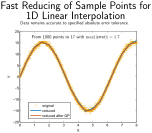

## README (reduce-linear-interp1)

[](https://github.com/danielrherber/reduce-linear-interp1/releases/latest)
[](https://github.com/danielrherber/reduce-linear-interp1/blob/master/License)

[](https://www.mathworks.com/products/matlab.html)
[](https://github.com/danielrherber/reduce-linear-interp1/issues)
[](https://github.com/danielrherber/reduce-linear-interp1/graphs/contributors)

For a specified absolute error tolerance, reduce a 1D dataset for use with linear interpolation (interp1) in MATLAB.



---
### Install
* Download the project code: [reduce-linear-interp1](https://github.com/danielrherber/reduce-linear-interp1/archive/master.zip)
* Run [INSTALL_RLI1.m](INSTALL_RLI1.m) to automatically add the project files to your MATLAB path and open some examples. An easy method is to simply drag the file to the MATLAB command window.
```matlab
INSTALL_RLI1
```
* See [RLI1_examples.m](examples/RLI1_examples.m) for some examples
```matlab
open RLI1_examples
```

---
### Description
This submission reduces the size of the provided original X and Y data sets while maintaining a specified absolute error tolerance under linear interpolation (```interp1```) of the original data with the reduced set. The primary algorithm is recursive and utilizes the fact that linear interpolation is local; an interval consisting of the endpoints and the closest midpoint is checked for accuracy with linear interpolation only composed of those 3 points. If the absolute error is less than the specified tolerance, then the interval is satisfactory, and the points are saved. Otherwise, the interval is split into 2 halves based on the closest midpoint, and the algorithm is applied again until termination.

This approach may not select the minimum number of points but is extremely efficient and works on any dataset. Other similar table breakpoint reduction approaches seem to struggle with large data sets or ones with highly irregular data. However, this submission is limited to only 1D linear interpolation, while others work with higher dimensions and other interpolation schemes such as splines. One other similar project is [Table Breakpoint Optimization (MFX35194)](https://www.mathworks.com/matlabcentral/fileexchange/35194).

Two additional optimization-based techniques are available to help reduce the number of points and the mean squared error (MSE). To reduce the number of data points, the midpoint y value is varied with fminbnd to achieve minimum MSE. For certain intervals, this means the error tolerance is satisfied when it otherwise would not have been with the original midpoint y value. The second constructs a sparse quadratic program representing the MSE minimization problem subject to the absolute error constraint. This further reduces the MSE for the fixed reduced x points. Both of these options are enabled by default (```opts.interior_optflag``` and ```opts.post_optflag```) and require the optimization toolbox (but can be disabled).

#### Comparisons to MFX35194

To illustrate the potential usefulness of this submission, please consider the following case studies comparing to MFX35194. The computer architecture used for all cases was a desktop workstation with an i7-6800K CPU at 3.8 GHz, 32 GB DDR4 3200 MHz RAM, MATLAB 2020a update 3, and Windows 10 build 18363.900]. Parallel computing was used in Case 5.

Here we want to reduce the number of points needed to represent the following function:
```matlab
X = 0:0.1:10;
Y = 1./(X/100 + 0.01) + X.^2 - 0.1 * X.^3;
tol = 0.1; % absolute maximum error tolerance
```
The results for several cases are shown below:

| Case | MFX | CPU Time (s) | Max Error | MSE | Ni | opts.interior_optflag | opts.post_optflag |
|:-:|:-:|--:|--:|--:|--:|:-:|:-:|
| 1 | 52552 | 0.0326 | 8.2e-02 | 7.3e-04 | 34 | true | true |
| 2 | 52552 | 0.0165 | 8.5e-02 | 1.2e-03 | 34 | true | false |
| 3 | 52552 | 0.0169 | 5.6e-02 | 3.4e-04 | 39 | false | true |
| 4 | 52552 | 0.0017 | 8.8e-02 | 1.0e-03 | 39 | false | false |
| 5 | 35194 | 19.3934 | 6.3e-02 | 1.7e-04 | 69 | - | - |

We see an enormous improvement in CPU time and number of points with Cases 1-4 using MFX52552 compared to Case 5 using MFX35194. The MSE in Case 5 is smaller but also has substantially more points. With the additional optimization routines in [reduce_linear_interp1.m](src/reduce_linear_interp1.m) enabled, the CPU time increases slightly but improvements are seen in both MSE or number of points.

Now consider the case when more points are provided (100x from the previous case study):
```matlab
X = 0:0.001:10;
Y = 1./(X/100 + 0.01) + X.^2 - 0.1 * X.^3;
tol = 0.1; % absolute maximum error tolerance
```
The results for several cases are shown below:

| Case | MFX | CPU Time (s) | Max Error | MSE | Ni | opts.interior_optflag | opts.post_optflag |
|:-:|:-:|--:|--:|--:|--:|:-:|:-:|
| 1 | 52552 | 0.3283 | 9.5e-02 | 5.3e-04 | 35 | true | true |
| 2 | 52552 | 0.0231 | 9.5e-02 | 1.2e-03 | 35 | true | false |
| 3 | 52552 | 0.4405 | 6.2e-02 | 2.9e-04 | 41 | false | true |
| 4 | 52552 | 0.0024 | 9.7e-02 | 1.5e-03 | 41 | false | false |
| 5 | 35194 | 17.1965 | 9.0e-02 | 9.8e-04 | 39 | - | - |

Here we see that Case 5 is actually faster than when fewer points were included (but the errors are now higher), potentially indicating some unpredictable behavior. The scaling of the methods that use ```opts.post_optflag``` is not ideal because of the quadratic program that is solved, while the other cases scale well.
Now, consider Cases 2/4 compared to Case 5. Here max error and MSE are all similar. However, the computational cost of Case 5 (MFX35194) to Cases 2/4 is 744x and 7165x, respectively, even using parallel computing in Case 5. Certainly, there are important trade-offs to consider between the submissions when using 1D linear interpolation.

In this final case, consider the following example with lots of noise:
```matlab
X = linspace(0,8,1000)';
F = round(15*sin(X));
Y = F + round(0.55*rand(size(X))) - round(0.55*rand(size(X))) ;
tol = 1;
```

The results for several cases are shown below:

| Case | MFX | CPU Time (s) | Max Error | MSE | Ni | opts.interior_optflag | opts.post_optflag |
|:-:|:-:|--:|--:|--:|--:|:-:|:-:|
| 1 | 52552 | 0.3658 | 1.0e+00 | 1.1e-01 | 276 | true | true |
| 2 | 52552 | 0.1641 | 1.0e+00 | 1.6e-01 | 276 | true | false |
| 3 | 52552 | 0.1964 | 1.0e+00 | 1.1e-01 | 272 | false | true |
| 4 | 52552 | 0.0089 | 1.0e+00 | 1.6e-01 | 272 | false | false |
| 5 | 35194 | 1219.1965 | 9.4e-01 | 4.9e-02 | 754 | - | - |

Here, Cases 1-4 quickly find valid solutions with exactly the desired max error and similar times to the previous example. However, Case 5 eventually finds a valid solution but with many more points, max error lower than the specified value, and computational times 3333-138544x longer.

---
### General Information

#### Contributors
- [Daniel R. Herber](https://github.com/danielrherber) (primary)

#### Project Links
- [https://github.com/danielrherber/reduce-linear-interp1](https://github.com/danielrherber/reduce-linear-interp1)
- [https://www.mathworks.com/matlabcentral/fileexchange/52552](https://www.mathworks.com/matlabcentral/fileexchange/52552)